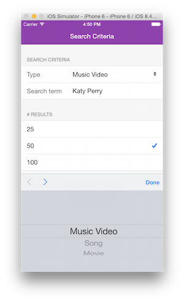
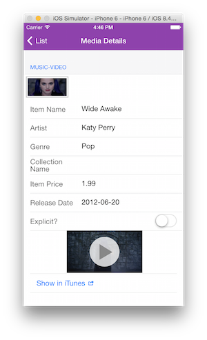
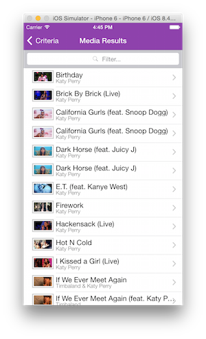

PhoneGap TouchstoneJS Sample App - iTunes Media Player
========================================================

TouchstoneJS Sample App for PhoneGap. An iTunes Media Finder - search for songs, movies or videos and preview them in app or open in iTunes.

To build and preview locally, run the `gulp dev` task. It will build the app with browserify, create the cordova assets (www etc) folder for mobile
and start a preview server at [localhost:8000](http://localhost:8000). 

###PhoneGap CLI Instructions
1. `gulp dev`
3. `phonegap run ios` (or `phonegap run android`)

###Cordova CLI Instructions
1. `gulp dev`
2. `cordova platform add ios (or cordova platform add android)` 
3. `cordova run` 

