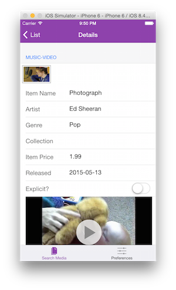

PhoneGap Sample App - ReactJS
==============================================
This sample app is an iTunes Media Finder app built with ReactJS and TouchstoneJS. TouchstoneJS is a mobile UI framework built on top of 
ReactJS/HTML5/CSS3 and Cordova. The sample allows you to search for songs, music videos or movies and preview them or open a result in iTunes. 

### Built with
1. ReactJS
2. TouchstoneJS
3. HTML5
4. CSS3
5. Cordova

### Demo
You can try it out quickly in the web app version located [here](http://devgirl.org/files/phonegap-react/). Enter the desired search term  
and criteria, then click **Show Results** to query the iTunes Search API. You can also set preferences as desired.  

### Quick Start
1. Clone the project 
2. Create a phonegap project 
    `$ phonegap create myApp`
3. Replace the `www` folder and the `config.xml` file with the `www` folder and `config.xml` from my sample project cloned in step 1. Also copy in the 
`resources` folder for the custom icons and splash screens to be used. 
4. *Serve* the app via the PhoneGap CLI (`$ phonegap serve`) or via the [PhoneGap Desktop Application](https://github.com/phonegap/phonegap-app-desktop)
5. Open the PhoneGap Developer app on your mobile device (availabel from app stores) and connect to the IP Address your app was served on. 

See the [PhoneGap Docs Quick Start](http://docs.phonegap.com/getting-started/2-install-mobile-app/) for more details on this process.
 
 

### Overview
If you want to make changes on your own you'll need to 

## Build Locally
To build and preview locally, install the node dependences (`$ npm install`) and run the `gulp dev` task. It will build the app with 
browserify, create the cordova assets (www etc) folder for mobile and start a preview server at [localhost:8000](http://localhost:8000). 

### PhoneGap CLI Instructions
1. `gulp dev`
3. `phonegap run ios` (or `phonegap run android`)

### Cordova CLI Instructions
1. `gulp dev`
2. `cordova platform add ios (or cordova platform add android)` 
3. `cordova run` 

###Plugins
The plugin dependencies should be fetched and added by the PhoneGap/Cordova CLI for you upon adding the platforms since they are specified in the config.xml.
However, you can check to see if they've been added by running: 

  `$ phonegap plugin list` or `$ cordova plugin list` 
  
**Plugins Required**
1. cordova-plugin-whitelist  
2. cordova-plugin-device
3. cordova-plugin-statusbar
4. cordova-plugin-splashscreen
5. cordova-plugin-console
6. cordova-plugin-inappbrowser
  
 You can manually add them with the CLI:
 
 `$ cordova plugin add cordova-plugin-whitelist`

or 

 `$ phonegap plugin add cordova-plugin-whitelist`